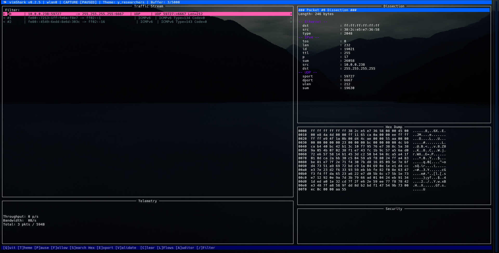
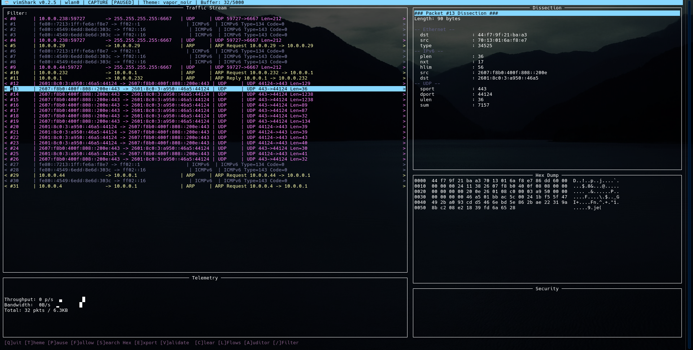

# 🦈 vimShark

**Author:** [J4ck3LSyN](https://x.com/J4ck3LSyN)  
**Version:** 0.2.5

---

**vimShark** is a high-performance, terminal-based network telemetry analyzer and security auditing tool. Engineered for systems administrators and security researchers, it provides a production-grade TUI (Terminal User Interface) for real-time packet dissection, flow reassembly, and passive + active threat detection.

Built on the high-speed **dpkt** parsing engine and **pcapy-ng** for low-latency capture, vimShark delivers deep packet insights directly in your terminal with support for rich 24-bit True Color themes.

## Key Features

*   **Real-Time Telemetry**: Live packet-per-second (pps) and bandwidth monitoring with Unicode sparkline visualizations.
*   **Advanced Security Auditing** (toggleable):
    *   ARP Spoof Detection (MAC-IP binding changes)
    *   Port Scan Detection (random/excessive + sequential)
    *   Host Scan Detection (ICMP + ARP sweeps)
    *   TCP SYN Flood & ICMP Flood Detection
    *   Credential Leak Detection (Basic Auth, Bearer, passwords, API keys, etc.)
*   **Deep Packet Dissection**: Ethernet, IPv4/IPv6, ARP, TCP, UDP, ICMP/ICMPv6, DNS, NTP, HTTP, TLS.
*   **TLS/SSL Intelligence**:
    *   Full ClientHello/ServerHello parsing
    *   JA3 & JA3S fingerprinting
    *   SNI + ALPN extraction
    *   X.509 certificate parsing (subject, issuer, validity, SAN, fingerprints, OCSP, CRL, expiry checks)
*   **IP Fragment Reassembly**: Stateful IPv4 reassembly.
*   **Stream Following**: Full-duplex TCP/UDP stream reassembly and payload viewing.
*   **Interactive Hex Dump**: With search and highlighting.
*   **Powerful Filtering**: Complex expressions with `&&`, `||`, field operators (`proto`, `src`, `dst`, `sni`, `ja3`, `cred`, etc.).
*   **PCAP Support**: Read from and write to standard PCAP files (filtered export supported).
*   **Highly Customizable**: 8+ built-in themes with true-color support.

### Prerequisites

- Python 3.8+
- Root/admin privileges for live capture
- `libpcap` / `tcpdump` development headers (for pcapy-ng)

### Theme Examples
<p align="center">


<br />


<br />


<br />


</p>

## Quick Start

1. **Clone & Setup**
    ```bash
    git clone https://github.com/J4ck3LSyN-Gen2/vimShark.git
    cd vimShark
    python3 -m venv vsEnviron
    source vsEnviron/bin/activate
    ```

2. **Install Dependencies**
    ```bash
    python3 -m pip install --upgrade pip
    python3 -m pip install urwid
    python3 -m pip install -t . dpkt pcapy-ng
    # Optional but recommended:
    # python3 -m pip install cryptography scapy
    ```

3. **Run**
    ```bash
    sudo python3 vs025.py -i wlan0                    # Live capture
    sudo python3 vs025.py -i wlan0 -o capture.pcap    # Capture + save
    python3 vs025.py -r capture.pcap                  # Offline analysis
    ```

## Usage Examples

```bash
# Live capture on specific interface
sudo python3 vs025.py -i eth0

# With custom theme
sudo python3 vs025.py -i eth0 --theme cyberpunk

# Read PCAP with buffer size
python3 vs025.py -r capture.pcap --buffer 10000

# Throttled capture (packets/sec)
sudo python3 vs025.py -i wlan0 --max-rate 500
```

## Interactive Controls

| Key          | Action                                      |
|--------------|---------------------------------------------|
| `Q` / `ESC`  | Quit / Close modal                          |
| `T`          | Cycle themes                                |
| `P`          | Pause / Resume capture                      |
| `/`          | Focus filter bar                            |
| `S`          | Search in current hex dump                  |
| `F`          | Follow TCP/UDP stream of selected packet    |
| `V`          | Security tools (ARP probe, etc.)            |
| `C`          | Clear buffer                                |
| `A`          | Auditor settings                            |
| `L`          | Show top flows                              |
| `E`          | Export filtered packets to PCAP             |
| `Enter`      | View packet details                         |

## Display Filters

Supports field-based queries with logic:

- `proto == tls && sni == example.com`
- `ja3 == 1234567890abcdef1234567890abcdef`
- `cred == yes || proto == http`
- `src == 192.168.1.100 && port == 443`

## Themes

vimShark ships with multiple carefully crafted themes:

- `btop_classic` (default)
- `y_researchers`
-    _Credit:_ [@uwu_underground](https://x.com/uwu_underground)
- `nullsecurityx` 
-    _Credit:_ [@NullSecurityX](https://x.com/nullsecurityx)    
- `arch_yuki` 
-    _Credit:_ [@Archknight23](https://x.com/Archknight23)  
- `neon_sakura`
- `vapor_noir`
- `gruvbox_dark`
- `dracula`
- `cyberpunk`

## Security Disclaimer

vimShark is intended for **authorized** network monitoring and security research only. Unauthorized use on networks you do not own or have explicit permission to monitor is illegal. The author assumes no liability for misuse.

---

<p align="center">
  <strong>Built with ❤️ by <a href="https://github.com/J4ck3LSyN-Gen2">J4ck3LSyN</a> | Chaos Foundry Security Division</strong><br>
  <sub>MIT License | Copyright © 2026</sub>
</p>
