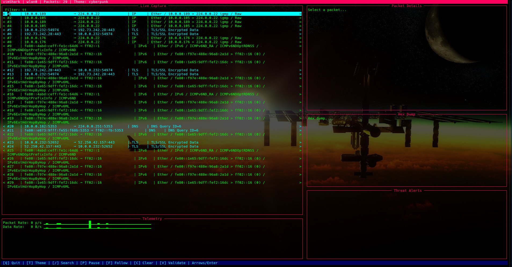
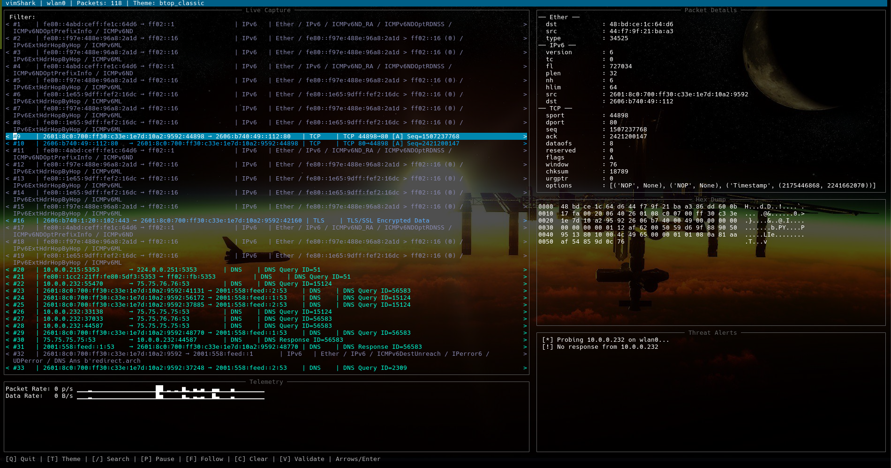
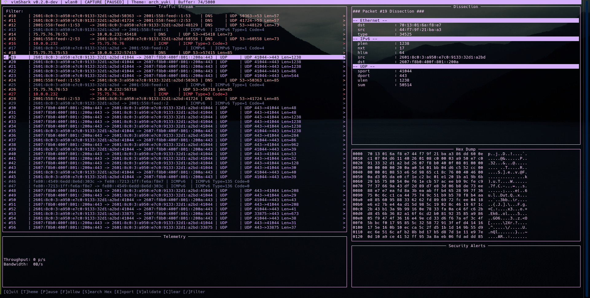
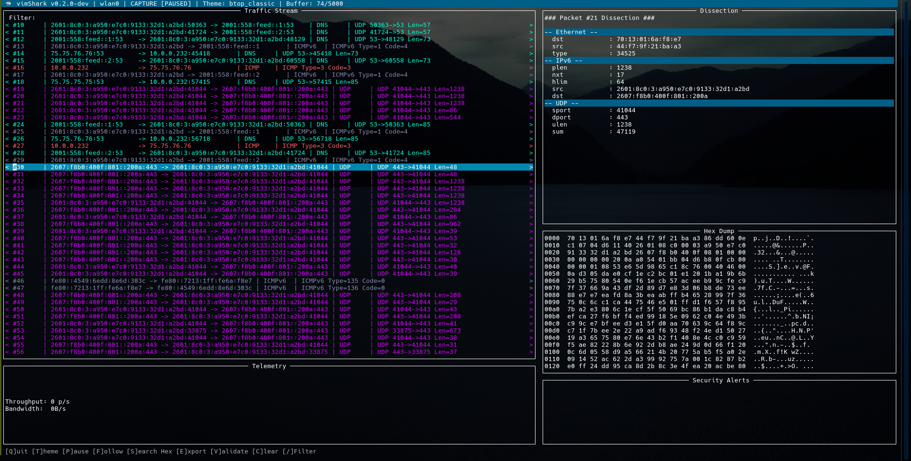
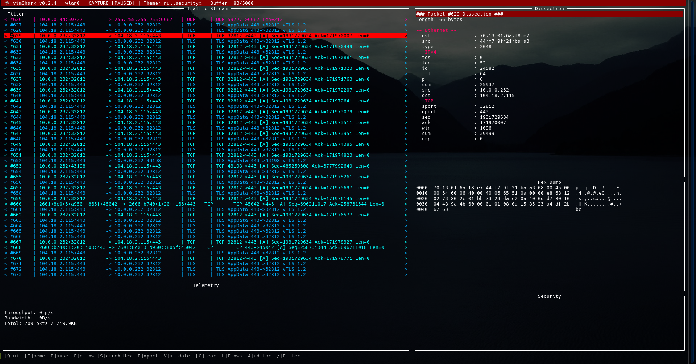
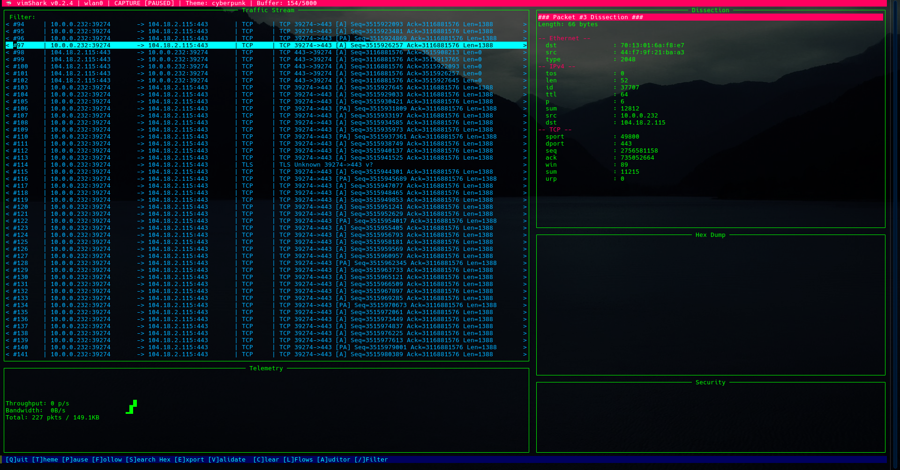

# 🦈 vimShark

**Author:** J4ck3LSyN  
**Version:** 0.2.4

---

**vimShark** is a high-performance, terminal-based network telemetry analyzer and security auditing tool. Engineered for systems administrators and security researchers, it provides a production-grade TUI (Terminal User Interface) for real-time packet dissection, flow reassembly, and passive threat detection.

Built on the high-speed **dpkt** parsing engine and **pcapy-ng** for low-latency capture, vimShark delivers deep packet insights directly in your terminal with support for 24-bit True Color themes.

## Key Features

*   **Real-Time Telemetry**: Live packet-per-second (pps) and throughput (bps) monitoring with Unicode-block sparkline visualizations.
*   **Real-Time Security Auditing**: Togglable audits during packet flow to detect different port scan types.
*   **Deep Packet Dissection**: Structural decoding of Ethernet, IPv4/IPv6, ARP, TCP, UDP, ICMP, DNS, NTP, and more.
*   **Encrypted Traffic Insight**: SNI extraction, full X.509 certificate parsing, and OCSP stapling detection.
*   **IP Reassembly**: Native stateful reassembly of fragmented IPv4 traffic.
*   **Stream Reassembly**: Full-duplex TCP/UDP stream following and payload reconstruction.
*   **Hex/ASCII Search**: Interactive pattern matching and highlighting within the hex dump viewer.
*   **Security Auditing**:
    *   **Passive ARP Spoof Detection**: Monitors MAC-to-IP binding changes against system baselines.
    *   **Active Validation**: Dispatch targeted ARP probes (via raw sockets or Scapy) to verify disputed network identities.
    *   **Credential Leak Detection**: Passive scanning for unencrypted sensitive keywords (user, pass, secret, etc.) in raw payloads.
*   **Advanced Filtering**: Support for complex display filters using logic operators (`&&`, `||`, `==`).
*   **Persistence**: Read from and write to standard PCAP files for offline forensic analysis.
*   **Highly Customizable**: 8+ built-in color schemes including Dracula, Nord, Gruvbox, and Cyberpunk.

## Themes

<p align="center">
  
  
  <br />
  
  
  <br />
  
  
</p>

### Prerequisites

vimShark requires Python 3.8+ and administrative privileges to bind to raw sockets.

## Quick Start

1. **Clone the Repository**
    ```bash
    git clone https://github.com/J4ck3LSyN-Gen2/vimShark.git
    cd vimShark
    ```

2. **Create a Virtual Environment**
    ```bash
    python3 -m venv vsEnviron
    source vsEnviron/bin/activate    # Use vsEnviron/bin/activate.fish on Fish shell
    ```

3. **Install Dependencies**
    > **Note:** Depending on your OS, you may need to install `tcpdump` or `libpcap` (and development headers) for Scapy/pcapy-ng to work correctly with your network hardware.
    ```bash
    python3 -m pip install --upgrade pip
    python3 -m pip install urwid 
    python3 -m pip install -t . dpkt pcapy-ng
    # Optional:
    # pip install cryptography scapy    # for certificate parsing and active probes
    ```

4. **Run vimShark**
    ```bash
    # Requires root/admin privileges
    sudo python3 vs.py -i wlan0                  # Replace wlan0 with your interface
    sudo python3 vs.py -i wlan0 -o cap_wlan0.pcap # Capture to PCAP
    sudo python3 vs.py -r cap_wlan0.pcap         # Read from PCAP
    ```

5. **Deactivate Environment** (when done)
    ```bash
    deactivate
    ```

## 🛠 Usage

### Basic Sniffing
```bash
sudo python3 vs.py -i eth0
```

### Offline Analysis
```bash
python3 vs.py -r capture.pcap
```

### Live Export
```bash
sudo python3 vs.py -i eth0 -o output.pcap
```

### Start With a Specific Theme
```bash
sudo python3 vs.py -i eth0 --theme cyberpunk
```

## Interactive Keybindings

| Key          | Action                                      |
|--------------|---------------------------------------------|
| `Q` / `ESC`  | Quit / Close Overlay                        |
| `T`          | Cycle UI Themes                             |
| `P`          | Pause/Resume Live Capture                   |
| `/`          | Focus Filter Bar                            |
| `S`          | Search Strings Inside Hex Dumps             |
| `F`          | Follow TCP/UDP Stream (on selected packet)  |
| `V`          | Trigger Active ARP Validation Probe         |
| `C`          | Clear Packet Buffer                         |
| `A`          | Toggle Packet Audits                        |
| `Enter`      | Inspect Selected Packet                     |
| `Arrows`     | Navigate Packet List / Hex Dumps            |

## '/' Display Filters

vimShark supports a powerful filtering syntax. Combine fields with `&&` (AND) and `||` (OR).

**Example Queries:**
*   `type == tcp && ip.src == 192.168.1.5`
*   `type == dns || type == ntp`
*   `in_data == 414141` (Search for hex pattern in raw payload)

## 'T' Supported Themes

*   **nullsecurityx**: Styled after the infosec researcher & bug bounty hunter - [@NullSecurityX](https://x.com/NullSecurityX)
*   **archu_yuki**: Styled after the ChaosFoundry director - [@Archknight23](https://x.com/Archknight23)
*   **btop_classic**: High-contrast professional blue
*   **Dracula**: The classic dark mode favorite
*   **Nord**: Arctic-inspired clean aesthetic
*   **Gruvbox**: Retro "groove" dark theme
*   **Cyberpunk**: High-saturation neon visuals
*   **Solarized Dark**: Precision-calibrated color palette

## Security Disclaimer

This tool is intended for authorized network monitoring and security auditing only. Using vimShark for unauthorized interception of traffic on networks you do not own or have explicit permission to audit is illegal and unethical. The authors assume no liability for misuse of this software.

## License

Distributed under the MIT License. See `LICENSE` for more information.
